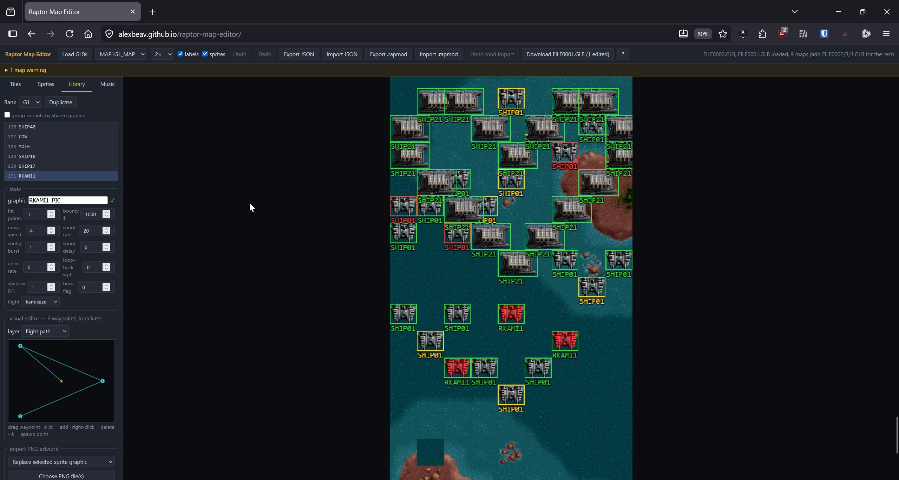

# Raptor Map Editor

A level and enemy editor for **Raptor: Call of the Shadows** (1994), rebuilt
from scratch ~32 years after the original in-house editor's source code was
lost. Published with the blessing of Raptor's creator, Scott Host.

The editor is **one HTML file with zero dependencies**: open `index.html` in a
browser, drop in your own game data files, and edit. Nothing is uploaded
anywhere — everything runs locally in the tab, and your original files are
never modified (saving downloads patched copies).



## What it does

- **Edit all 27 levels** — paint tiles (with destructible-tile markers and a
  right-click eyedropper), edit destructible-tile break targets/HP/bounties,
  place/move/delete enemies, set per-enemy difficulty (easy / medium / hard /
  secret), full-level view. Selecting a placed enemy also makes that type the
  active choice for repeated placement.
- **Catch level mistakes early** — a collapsible warnings strip identifies
  unused difficulty values, stalled spawn groups, empty maps, and missing tile
  or sprite-library references; click a warning to jump to it.
- **Undo and redo safely** — separate 100-step histories for each map and
  enemy-library bank, with buttons plus Ctrl+Z, Ctrl+Y, and Ctrl+Shift+Z.
- **Find enemy variants quickly** — optionally group placement and library
  entries by their shared graphic without changing their engine-facing indices.
- **Edit groups efficiently** — rectangle-select enemies, move or change their
  difficulty together, and copy complete spawn groups across maps and banks.
- **Recover interrupted work** — versioned local IndexedDB autosave restores
  maps, libraries, destructible tiles, music, undo history, and dirty state.
- **Work directly in the game folder where supported** — Chromium browsers on
  a secure origin can open and save the GLBs in place while preserving an
  immutable first-save `.bak`. The first direct write requires confirmation;
  downloads remain the default and universal fallback.
- **Import and create artwork** — PNGs are quantized locally to Raptor's VGA
  palette. Replace tiles or sprite graphics in place, or append consecutive
  multi-frame sprites without shifting existing positional item IDs.
- **Edit combat effects visually** — the Library canvas switches between
  flight paths, gun mounts, and engine flares; drag/add/delete points and edit
  shot types or flame widths over the actual sprite graphic.
- **Share compact mods without base-game records** — `.rapmod` export stores
  only changed cells, spawn groups, record fields/appends, and replacement MUS
  or PIC data. Import verifies item-level SHA-256 hashes, previews affected
  content, validates the complete result, and applies it transactionally with
  one-click rollback. It emits compatible v1 unless embedded artwork requires v2.
- **Change soundtrack slots** — choose another built-in track, import a DMX
  `.MUS` file, or import Standard MIDI format 0/1 for local conversion to MUS.
  The original engine hard-codes eight shared slots, so the editor
  shows every other level affected before a slot is changed.
- **Edit the enemies themselves** — every enemy definition in the game: hit
  points, bounty, speed, fire rate, flight AI type, and the **flight path** on
  a visual waypoint canvas (drag, click to add, right-click to delete).
  Select a placed enemy and its flight path overlays the map.
- **Create new enemies** — *Duplicate* appends a copy as a brand-new entry.
  The engine derives the enemy count from the data size, so new enemies work
  in the **unmodified original game** — DOS, Steam, or the 2015 Edition.
- **Round-trip safe** — every file format was validated byte-for-byte against
  the shipped data; re-saving an untouched map reproduces the archive
  byte-identically. The engine's spawn-order invariant (see
  [FORMATS.md](FORMATS.md)) is enforced automatically.

## Quick start

1. Open `index.html` in any modern browser.
2. Drag `FILE0000.GLB`–`FILE0004.GLB` from your Raptor install onto the page
   (v1.2+ data; the shareware's `FILE0000`+`FILE0001` also works).
3. Pick a map. The **?** button covers the rest.
4. **Download GLB** saves patched copies. Back up your originals, drop the
   patched files into your game folder, and play. Where the browser exposes
   folder access, **Open game folder…** can save directly after creating
   first-save `.bak` files.

**Which game version?** The classic 1994 game and the *2015 Edition* ship
the same `file0000`–`file0004.glb` (SHA-256 identical), so the editor reads
either. For **playing** your edits, use the 1994 engine — DOS Raptor under
DOSBox, the Steam 1994 release, or the
[open-source port](https://github.com/skynettx/raptor) — where patched GLBs
are confirmed working. The 2015 Edition is a different engine and is
untested with modified files (its extra `file0005/0006.glb` aren't used by
this editor). Work-in-progress or modified GLBs from newer builds are not
supported.

## Command-line tools

`tools/` contains companion format functionality as scriptable Python (3.10+;
`pip install -r requirements.txt` installs Pillow for the graphics commands):

```
python tools/glbtool.py list      <FILE000n.GLB>          # inspect archives
python tools/glbtool.py verify    <FILE000n.GLB>          # prove lossless round trip
python tools/glbtool.py map2json  <datadir> MAP1G1        # level  <-> editable JSON
python tools/glbtool.py json2map  <datadir> map1g1.json
python tools/glbtool.py lib2json  <datadir> 1             # enemies <-> editable JSON
python tools/glbtool.py json2lib  <datadir> lib.json
python tools/glbtool.py mod2glb   <datadir> mod.rapmod -o patched  # apply a mod safely
python tools/glbtool.py pic2png   <datadir> SHIP01G1_PIC  # any graphic -> PNG
python tools/glbtool.py png2pic   <datadir> art.png --name MYSHIP_PIC   # PNG -> game
python tools/render_map.py <datadir> --all                # render all 27 levels to PNG
```

`png2pic` quantizes to the game palette and encodes either graphic format;
the encoder reproduces the original tool's output byte-for-byte on
re-encoded sprites.

## Sharing mods

Use **Export .rapmod** after editing to create a versioned, human-readable
patch. A `.rapmod` contains item hashes and author-created differences rather
than complete unchanged maps or sprite/tile-property records. Version 2 can
also carry replaced or appended PIC artwork addressed by archive and item index,
which safely handles unnamed and duplicate-name graphics. Mods without artwork
use version 1, and both versions remain importable.
Recipients load their own GLBs, choose **Import .rapmod**, review the affected
maps, banks, artwork, and music slots, and confirm. A hash mismatch or invalid
reference rejects the whole import without applying a partial change;
**Undo mod import** restores the complete pre-import session.

The equivalent non-destructive command-line workflow writes patched GLBs into
a separate directory:

```
python tools/glbtool.py mod2glb /path/to/raptor mod.rapmod -o patched
```

Keep `.rapmod` files to changes you have the right to distribute. The format
design reduces accidental redistribution of unchanged game data; it is not a
legal determination about a particular mod.

## Delta Sector — editing the community 4th campaign

[Raptor Enhanced](https://github.com/Alexbeav/raptor-enhanced) is a native
Windows build of the open-source engine that supports **Delta Sector**, an
optional community-made 4th campaign (9 new waves remixed from the game's own
three sectors). Because its installer patches *your* `FILE0001`/`FILE0004`,
the new `MAP1G4`–`MAP9G4` levels are ordinary map items — and this editor
picks them up automatically:

1. Install [Raptor Enhanced](https://github.com/Alexbeav/raptor-enhanced/releases)
   into your game folder. For the campaign data, either run the bundled
   `DeltaSector-optional` installer — or skip Python entirely: load your GLBs
   in this editor and click **Add Delta Sector** to download patched
   `FILE0001`/`FILE0004` (byte-identical to the installer's output; keep
   backups of your originals).
2. Load your now-patched GLBs here. The nine G4 maps appear in the map list
   next to the original 27.
3. Edit them like any level — tiles from all three tilesets on one map,
   enemies from any bank, flight paths, difficulty, and music (Delta has its
   own soundtrack slot table in the Enhanced engine).
4. Save `FILE0004.GLB` back to the game folder, launch `raptor.exe`, and
   press **D** in the hangar's Ship Computer to play your changes.
5. Share Delta redesigns as `.rapmod` — the Delta installer is deterministic,
   so every Delta install has identical base data and imports verify cleanly.

## Tests

Fixture-independent codec and validation tests run without game data:

```
node tests/test_editor_core.mjs
python -m unittest discover -s tests -p "test_*.py"
```

The synthetic browser smoke test also uses no game data:

```
npm ci
npx playwright install chromium
npm run test:browser
```

Pass a GLB directory to the Node test to additionally run the proprietary-data
round-trip checks: `node tests/test_editor_core.mjs <datadir>`.

## Legality

This repository contains **no game data and no game code** — you supply your
own GLB files from a copy of the game you own
([Steam](https://store.steampowered.com/app/336060/),
[GOG](https://www.gog.com/game/raptor_call_of_the_shadows_2015_edition)).
The file formats were reverse-engineered from the released DOS source code
and the GPL-2 [skynettx/raptor](https://github.com/skynettx/raptor) port,
then validated against the shipped data. Don't redistribute game files or
archives containing them. JSON export contains complete map data and is
intended for personal backup and tooling. For sharing author-created changes,
use the base-hashed `.rapmod` patch format described above, which omits
unchanged base map cells and library records.

## Credits

- **Scott Host** — for Raptor, the released source, and the go-ahead to
  publish. Buy his games: [mking.com](https://www.mking.com).
- Built by **Alexbeav** with **Claude (Fable)**, Anthropic's AI agent — the
  format recovery, the editor, and these tools came out of one long session
  of reading 1994 C code together.
- **nukeykt** and **skynettx** — the reverse-engineered source port that made
  format validation possible.
- The [DOS Game Modding Wiki](https://moddingwiki.shikadi.net/wiki/Raptor) —
  prior GLB format documentation.

MIT licensed. See [FORMATS.md](FORMATS.md) for the complete file-format
reference recovered during this project.
